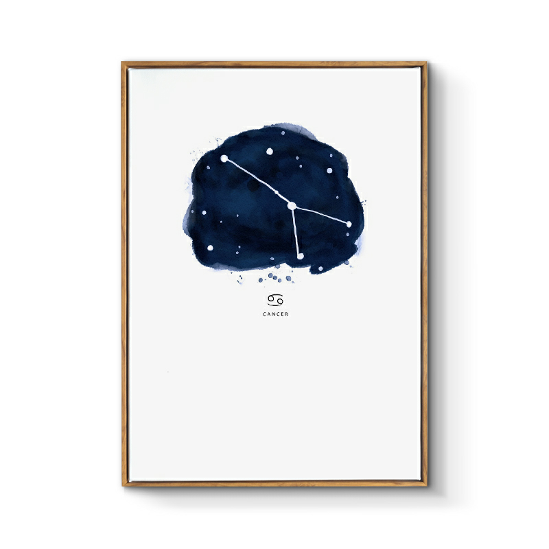

## 巨蟹座

&nbsp;

### 巨蟹座：6月22日-7月22日

&nbsp;

巨蟹座，是黄道十二宫的第四宫，守护神为赫拉，是万神之母，这代表着巨蟹座天生就拥有母性光辉和父性光辉，非常的重视自己的家庭和亲人。它的守护星为月亮，月有阴晴圆缺，如同月亮一般，巨蟹座的性格总是阴晴不定，情绪化非常严重，他们内心脆弱敏感，但又天性善良纯真，乐于助人，非常温顺让人亲近，身上的母性光芒，让人如沐春风，总是忍不住想要靠近他们。

