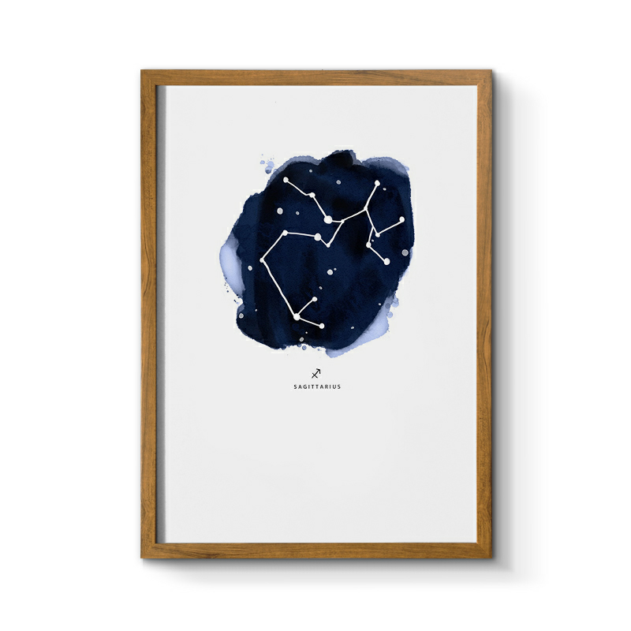

## 射手座

&nbsp;

### 射手座：11月23日-12月21日

&nbsp;

射手座是代表自由的星座，他们自由不羁，乐观开朗，热情率真，从不拐弯抹角，也讨厌做作，虚与委蛇，不真诚的人。自由是他们与生俱来的天性，他们特立独行，爱好自由，最不喜欢的就是被管教被束缚，这会让他们非常不满。射手座喜欢追求自己内心的精神世界，善于发现自己未知的领域，也愿意为之学习。射手座热情、友好、外向、直爽，喜欢和别人交朋友，喜欢随心所欲的侃侃而谈。射手座多才多艺，有超脱的想象力，对未知领域充满无限的好奇。他们享受着在超越物质的生命中遨游，感受着有别于生活的乐趣。

