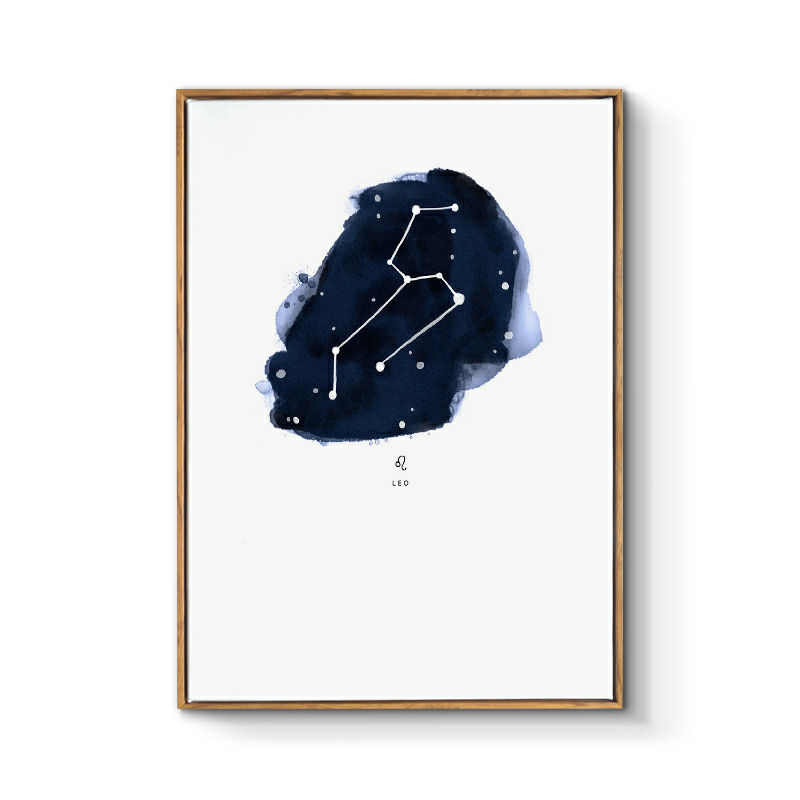

## 狮子座

&nbsp;

### 狮子座：7月23日-8月22日

&nbsp;

狮子座是王者星座，他们天生自带光环，特立独行，霸气侧漏，时时刻刻都展现着自己的威风霸气本色。他们做事豪爽大气，讲话淡定从容，从不扭扭捏捏畏畏缩缩。他们是天生的领导者，有着绝对的领导能力，喜欢指导和管理别人。狮子座的人观察能力很强，除了本身的自大之外，其实他们也有自大的资本，因为他们的能力非常强，而且心思细腻，做事完整准确，言谈举止，行为处事都非常有自己的一套，善于将自己的优点发挥到极致，展现自己的魅力。

