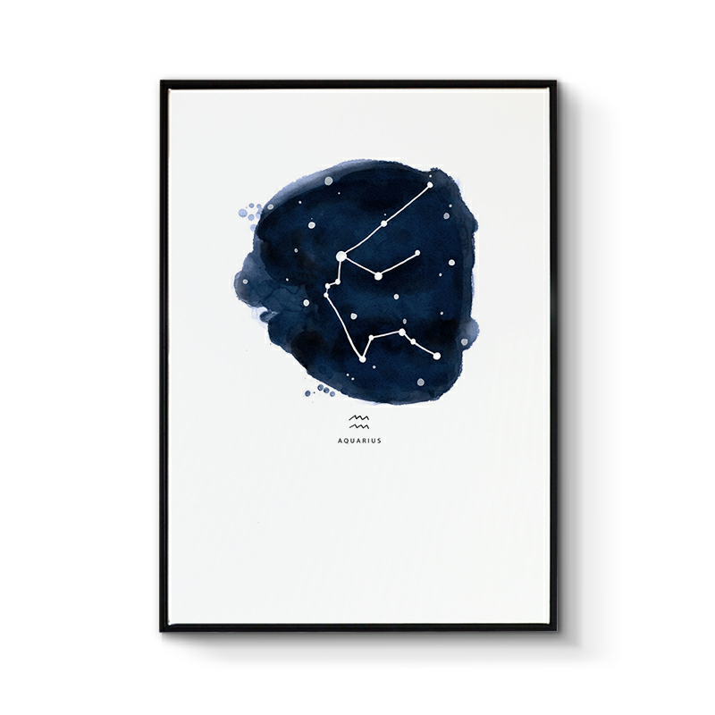

## 水瓶座

&nbsp;

### 水瓶座：1月20日-2月18日

&nbsp;

水瓶座的人非常重视自己的精神世界，是人道主义的支持者。他们待人和善、善于与人沟通，喜欢广交朋友。水瓶座的人他们外表呈现热情与冷漠交替的状态，他们静若处女动如脱兔，收放自如。他们喜爱一切新奇、新鲜的事物，乐于接受新的发现，喜欢探究神秘的东西。很有成为哲学家和艺术家的潜质。是一个非常跳脱，特立独行的星座。

