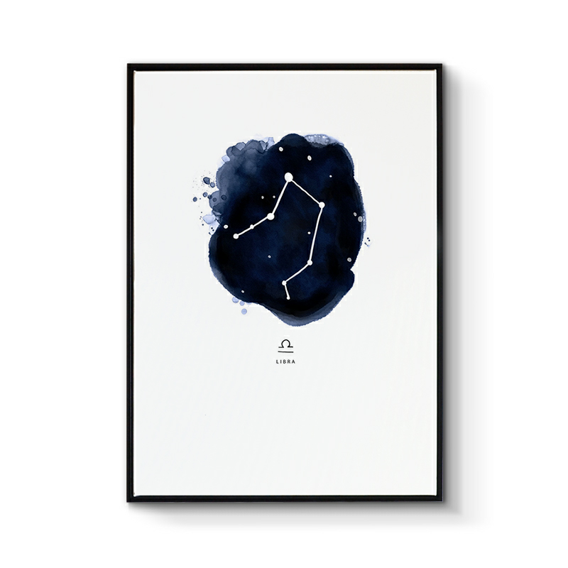

## 天秤座

&nbsp;

### 天秤座：9月23日—10月23日

&nbsp;

天秤座的人温柔儒雅，风度翩翩，喜欢和平，追求公平公正，向往着快乐自在的生活。天秤座非常注重自身的形象，落落大方，不卑不亢，与生俱来的独特气质总是非常的吸引人的目光，举手投足中散发着特有的温柔，言行举止非常稳重。天秤座有超强的审美观，对美的事物有敏锐的发现力，他们关注细节，注重品质。天秤座的人害怕孤独，喜欢热闹，因此他们喜欢交朋友，和朋友，恋人作伴，享受着生活的欢乐。

