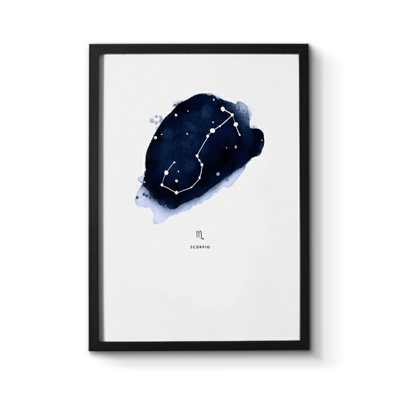

## 天蝎座

&nbsp;

### 天蝎座：10月23日-11月22日

&nbsp;

在秋天出生的天蝎座，守护星是冥王星，在水象和冥王的共同作用下，天蝎座的人性格阴沉内敛，成熟稳重，防备心重，占有欲强，复仇心强，是轻易不能得罪的人。天蝎座的人在情感上非常的专情，虽然表面上云淡风轻，沉默寡言，但是其实内心早已经波涛汹涌，他们是非常善于掩藏情感的星座。而且忍受不了背叛，一旦遭遇背叛，背叛者一定要承担起天蝎座无穷无尽的报复。天蝎座属于敢爱敢恨的类型，但是并不是大大咧咧，情商低的星座，相反他们的心思深沉，思虑周到，有很强的感知能力，外表非常的冷漠，给人一种难以接近的，冷若冰霜的感觉。

